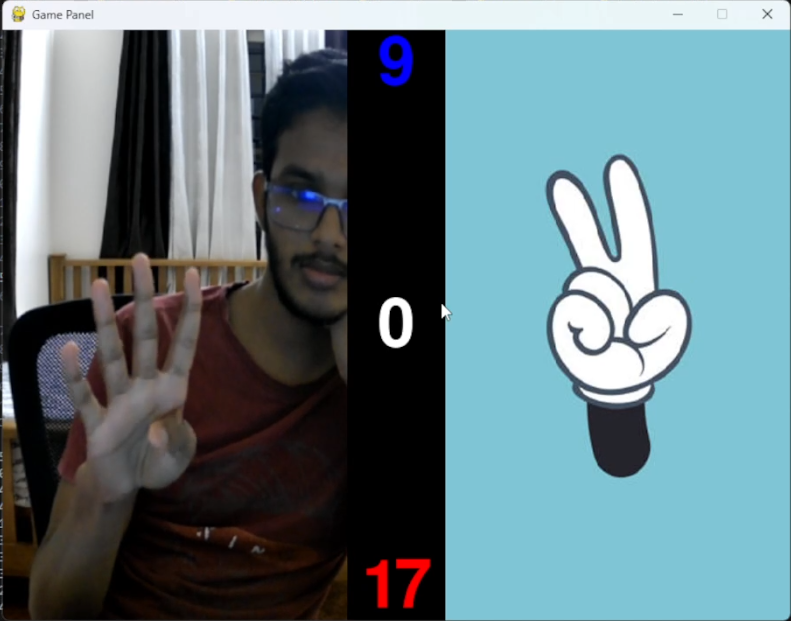

# Odd-Even-Game-ML-Computer-Vision

Enjoy a fun game of Odd or Even using Python and Pygame! Show numbers in front of the camera, and using computer vision and machine learning with MediaPipe, the game tracks and detects the numbers you show. Play against an AI opponent and take turns guessing odd or even. Who will emerge as the ultimate winner?

## Demo

[Link to YouTube Gameplay Video](https://youtu.be/f4sPPQQEP8w)

## Prerequisites

- Python (version 3.x)
- Pygame (version x.x.x)
- OpenCV (version x.x.x)
- MediaPipe (version x.x.x)

## Installation

1. Clone the repository:

   ```shell
   git clone https://github.com/Adithya-M-Dileep/Odd-Even-Game-ML-Computer-Vision
   ```
2. Install the required dependencies:
  ```shell
   pip install -r requirements.txt
  ```
## Usage
1. Run the game:
   ```shell
   python main.py
   ```
Follow the on-screen instructions to play the game.

Show numbers in front of the camera, and the game will track and detect them.

Take turns guessing odd or even, competing against the AI opponent.

After the game, the winner will be announced.

Note: Please ensure that you have a webcam connected to your computer and adjust the webcam number in the `cap = cv2.VideoCapture(0)` section of the main.py file if needed.
## Gameplay


